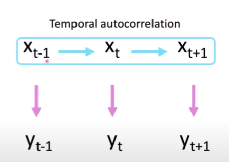

```{r}
library(dplyr)
library(ggplot2)
```


Process equation:

$$
x_t = f(x_{t-1}) + \eta _t
$$


* $x_t$ is the **process state**, for example, true population size.
* $f(x_{t-1})$ is the **behavioural mechanism**
* $\eta_t$ is the **process noise**

The process equation models the true, unobservable state of the variable $x$. It has an autorregressive structure, being a function of $x_{t-1}$

Measurement equation:

$$
y_t = g(x_t) + \epsilon_t
$$


* $y_t$ is the **observation data**
* $g(x_t)$ is the **observation mechanism**
* $\epsilon_t$* is the observation/measurement error


While there is temporal correlation between $x(t)$, there is no temporal correlation in $y(t)$!



# Basic example:

$$
x_t = x_{t-1} + \eta_t
$$

```{r}
#small simulation

n = 100 # number of observations
sd_p = 2 # standard deviaton of the process noise
sd_o = 1 # standard deviation of the observation error


# Usamos maiusculas por causa da sintaxe do ggplot
X0 = 100
X = c(X0)
for(i in 2:n){
  X[i] = X[i-1] + rnorm(1, 0, sd_p)
}

Y = c()
for(i in 1:n){
  Y[i] = X[i] + rnorm(1,0, sd_o)
}


ggplot() + 
  geom_point(aes(
    x = 1:n,
    y = X),
    color = 'blue') + 
  geom_point(aes(
    x = 1:n,
    y = Y),
    color = 'red') + 
  theme_bw()

```

# A more involved example:

$$
x_t = x_{t-1} + \gamma(x_{t-1} - x_{t-2}) + \eta_t 
$$

\begin{equation}
  z_t = z_{t-1} + \epsilon_t, \;\;\; \epsilon_t \sim \text{N}(0, \sigma_p^2),
  \label{E.toy2p.p} 
\end{equation}

# Fitting the data: Frequentist vs Bayesian


