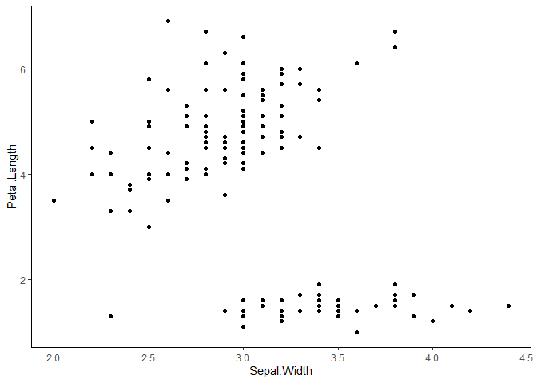

Handbook for Everything
================

# Exponential Distribution Family

The probability density function of the normal distribution is given by

 = \frac{1}{\sigma \sqrt{2\pi}}e^{-\frac{1}{2}(\frac{y-\mu}{\sigma})^2})")

which can be rewritten as

^2}{2\sigma^2}}")

and then, finally, applying the square of the multiplication rule, as:

}")

This particular form highlights a structure that is common to all
distributions in the exponential family, which we will examine below.

## General form of the exponential distribution family:

With "),
"),
")
and
")
being known functions in
:

 = h(x)\cdot c(\theta) \cdot e^{\sum_{i=1}^k w_i(\theta) \cdot t_i(x)}")

From the previous example,

 = \color{red}{1}\\
t_i(x) = \color{green}{\frac{1}{\sigma\sqrt{2\pi}}} \cdot \color{green}{e^ {\frac{-\mu^2}{2\sigma^2}}}\\
t_1(x) = \color{blue}{-x^2}\\
w_1(x) = \color{lightblue}{\frac{1}{2\sigma^2}}\\
t_2(x) = \color{pink}{x}\\
w_2(x) = \color{purple} {\frac{\mu}{\sigma^2}}")

## Alternate form of the bi-parametric exponential distribution family

 = e^{\frac{y\theta - b(\theta)}{a(\phi)} + c(y,\phi)}")

The previously shown p.d.f. of the normal distribution can also be
written as

 - \frac {y^2} {2 \sigma^2}}")

or

 - \frac {y^2} {2 \sigma^2}}}")

In this example, we have

 = \color{green}{\frac{\mu^2}{2}} \\
a(\phi) = \color{blue} {\sigma^2} \\
c(y,\theta) = \color{fuchsia}{ln(\frac{1}{\sigma\sqrt{2\pi}}) - \frac {y^2} {2 \sigma^2}}")

Therefore, the normal distribution can also fit this particular type of
structure. In this context,
 is
called a *natural parameter* and
 is called a
*dispersion parameter*.

# GLM - Generalized Linear Models

[source](https://online.stat.psu.edu/stat504/lesson/6/6.1#:~:text=The%20term%20%22general%22%20linear%20model,(with%20fixed%20effects%20only))

As we introduce the class of models known as the generalized linear
model, we should clear up some potential misunderstandings about
terminology. The term “general” linear model (GLM) usually refers to
conventional linear regression models for a continuous response variable
given continuous and/or categorical predictors. It includes multiple
linear regression, as well as ANOVA and ANCOVA (with fixed effects
only). The form is
")
where  contains
known covariates and
 contains
the coefficients to be estimated. These models are fit by least squares
and weighted least squares using, for example, SAS’s GLM procedure or
R’s lm() function.

The term “generalized” linear model (GLIM or GLM) refers to a larger
class of models popularized by McCullagh and Nelder (1982, 2nd edition
1989). In these models, the response variable
 is assumed to
follow an exponential family distribution with mean
, which is
assumed to be some (often nonlinear) function of
.
Some would call these “nonlinear” because
 is often
a nonlinear function of the covariates, but McCullagh and Nelder
consider them to be linear because the covariates affect the
distribution of 
only through the linear combination
.

There are three components to any GLM:

-   **Random Component** - specifies the probability distribution of the
    response variable; e.g., normal distribution for
     in the classical
    regression model, or binomial distribution for
     in the binary
    logistic regression model. This is the only random component in the
    model; there is not a separate error term.

-   **Systematic Component** - specifies the explanatory variables
    ,in
    the model, more specifically, their linear combination; e.g.,
    
    , as we have seen in a linear regression, and as we will see in the
    logistic regression in this lesson.

-   **Link Function**,
     or
    ") -
    specifies the link between the random and the systematic components.
    It indicates how the expected value of the response relates to the
    linear combination of explanatory variables; e.g.,
    ) = E(Y_i)")
    for classical regression, or
     = logit(\pi)")
    for logistic regression.

## R

``` r
df %>% 
  ggplot +
  geom_point(aes(x = Sepal.Width,
                 y = Petal.Length)) + 
  theme_classic()
```

<!-- -->
